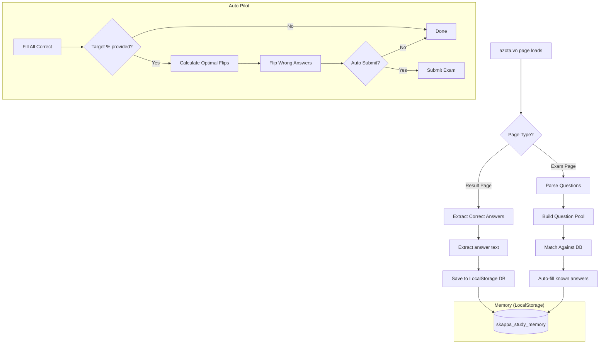
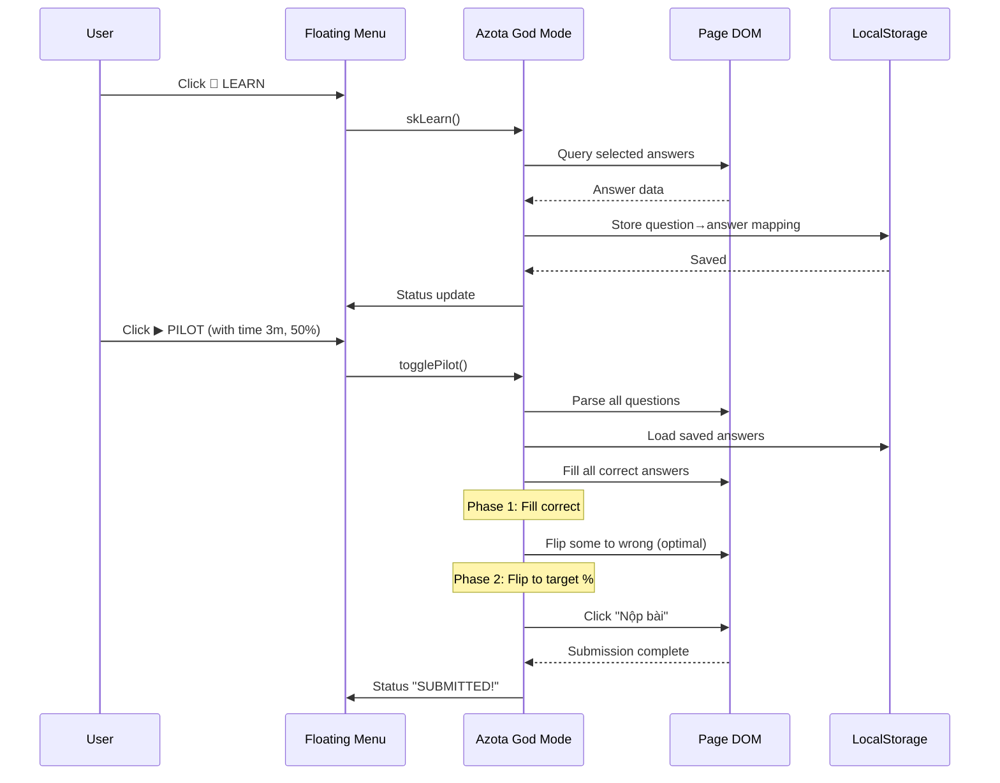

# ⚡ Azota God Mode

[]()
[]()
[](LICENSE)

> **A powerful Tampermonkey userscript for automating online exams on [azota.vn](https://azota.vn).**  
> Includes an intelligent Auto Pilot system, memory-based answer recall, quick-fill tools, support for True/False and Essay questions, result page analysis, and a sleek cyberpunk dark UI.

---

## 📋 Table of Contents

- [Overview](#-overview)
- [Features](#-features)
- [Why This Project Exists](#-why-this-project-exists)
- [How It Works](#-how-it-works)
- [Screenshots](#-screenshots)
- [Requirements](#-requirements)
- [Installation](#-installation)
- [Usage Guide](#-usage-guide)
- [Configuration](#-configuration)
- [Keyboard Shortcuts](#-keyboard-shortcuts)
- [Advanced: Pilot Input Format](#-pilot-input-format)
- [FAQ](#-faq)
- [Troubleshooting](#-troubleshooting)
- [Project Structure](#-project-structure)
- [Technical Architecture](#-technical-architecture)
- [Limitations](#-limitations)
- [Contributing](#-contributing)
- [Credits](#-credits)
- [License](#-license)

---

## 🚀 Overview

**Azota God Mode** is a Tampermonkey/Greasemonkey userscript that enhances the [azota.vn](https://azota.vn) online exam platform with automation capabilities. It provides:

- **Auto Pilot**: Automatically fill and submit exams with configurable timing
- **Memory System**: Learn correct answers from result pages, recall them later
- **Quick Fill**: One-click answer selection (A/B/C/D, True/False, or random)
- **Answer Extraction**: Extract correct answers from completed exam result pages
- **Data Sync**: Export/import answer databases via JSON files

The script operates **entirely client-side** — no data leaves your browser except what you explicitly export.

---

## ✨ Features

### 🧠 Memory System
| Feature | Description |
|---------|-------------|
| **Learn** | Capture selected answers from the current exam page into local memory |
| **Review** | Auto-fill questions using previously saved answers |
| **Learn from Results** | Extract correct answers from completed test result pages |
| **Highlight on Results** | Highlight matched answers on result review pages |
| **Export/Import** | Save your answer database as a JSON file or restore it later |

### 🤖 Auto Pilot
| Feature | Description |
|---------|-------------|
| **Time-based** | Set a specific time limit (e.g. 3m43s for a 3-minute 43-second exam) |
| **Target-based** | Specify a target score percentage (e.g. 80%) with optimal wrong-answer flipping |
| **Formula-aware** | Supports custom T/F scoring formulas (`equal`, `tapered`, or custom) |
| **Auto-submit** | Automatically submits the exam when finished |
| **Pause/Resume** | Stop and resume the pilot while preserving state |

### ⚡ Quick Fill
| Feature | Description |
|---------|-------------|
| **A/B/C/D** | Fill a specific answer letter across all multiple choice questions |
| **Random** | Fill all questions with random answers |
| **Pattern** | Fill answers following a custom pattern string (e.g. "ABCD", "AABB") |
| **Đúng/Sai** | Fill all True/False questions with Đúng or Sai |
| **TF Pattern** | Apply pattern-based filling to True/False questions (A/C = Đúng, B/D = Sai) |
| **Essay Draft** | Fill essay questions with random numeric drafts |

### 🎨 User Interface
- Cyberpunk dark emerald theme with glass-morphism effects
- Draggable floating menu
- Keyboard shortcuts (toggle with backtick `` ` ``)
- Status bar with real-time operation feedback
- Smooth hover and click animations

---

## 🤔 Why This Project Exists

Azota.vn is widely used by Vietnamese schools and universities for online testing. Students often need to:

1. **Review past exams** — Manually cross-referencing answers from a result page back to the exam is tedious
2. **Manage time** — During timed exams, manually selecting answers eats into thinking time
3. **Practice efficiently** — Quickly filling in known answers and focusing only on unfamiliar questions

This script was created as a **productivity tool** — not for cheating, but for **legitimate exam preparation and review** where the user already has access to the material.

---

## 🏗️ How It Works (High-Level Architecture)



### Internal Workflow



---

## 📸 Screenshots

### Floating Menu
```
┌─────────────────────┐
│ ⚡SKAPPA v15.3      │ ← Drag to move
├─────────────────────┤
│ AUTOPILOT           │
│ [▶ PILOT] [   ] i │
├─────────────────────┤
│ MEMORY              │
│ [🧠 LEARN] [🎯 REVIEW]│
│ [⬇ EXPORT] [⬆ IMPORT]│
│ [📋 LOG] [🗑 CLEAR]  │
├─────────────────────┤
│ QUICK FILL          │
│ [A] [B] [C] [D]     │
│ [🎲 RANDOM] [🚀 SUBMIT]│
├─────────────────────┤
│ DUNG/SAI            │
│ [✓ DUNG] [✗ SAI]    │
│ [TF PTN] [ESSAY]   │
├─────────────────────┤
│ PATTERN             │
│ [ABCD           ] ▶│
├─────────────────────┤
│ ■ Hidden · ` show   │
└─────────────────────┘
```

---

## 📦 Requirements

- **Browser**: Chrome, Firefox, Edge, or any browser that supports Tampermonkey
- **Extension**: [Tampermonkey](https://www.tampermonkey.net/) (recommended) or Greasemonkey / Violentmonkey
- **Network**: Access to `*.azota.vn`
- **OS**: Windows, macOS, Linux, or Android (with Kiwi Browser + Tampermonkey)

---

## 🔧 Installation

### Step 1: Install Tampermonkey

<details>
<summary><b>Chrome / Edge / Brave</b></summary>

1. Visit the [Chrome Web Store](https://chrome.google.com/webstore/detail/tampermonkey/dhdgffkkebhmkfjojejmpbldmpobfkfo)
2. Click **"Add to Chrome"**
3. Click **"Add Extension"** in the popup
4. You should see the Tampermonkey icon (🎭) appear in your toolbar

</details>

<details>
<summary><b>Firefox</b></summary>

1. Visit the [Firefox Add-ons page](https://addons.mozilla.org/en-US/firefox/addon/tampermonkey/)
2. Click **"Add to Firefox"**
3. Click **"Add"** in the popup

</details>

<details>
<summary><b>Android (Kiwi Browser)</b></summary>

1. Install [Kiwi Browser](https://play.google.com/store/apps/details?id=com.kiwibrowser.browser) from Google Play
2. Install Tampermonkey from [Chrome Web Store](https://chrome.google.com/webstore/detail/tampermonkey/dhdgffkkebhmkfjojejmpbldmpobfkfo) (works on Kiwi)
3. Follow the same steps as Chrome

</details>

### Step 2: Install the Script

**Option A — Install from GitHub (recommended)**

1. Navigate to [`src/azota-god-mode.user.js`](src/azota-god-mode.user.js) in this repository
2. Click the **Raw** button (or open the raw file URL)
3. Tampermonkey should automatically detect the userscript and show an installation page
4. Click **"Install"**

**Option B — Manual Installation**

1. Open Tampermonkey dashboard (click 🎭 → "Dashboard")
2. Click **"Create a new script"**
3. Delete all default template code
4. Copy the entire contents of `src/azota-god-mode.user.js`
5. Paste into the editor
6. Press **Ctrl+S** (or **Cmd+S**) to save

### Step 3: Verify Installation

1. Navigate to any page on `https://azota.vn`
2. Press the **backtick** key (`) `` ` `` — usually above the Tab key)
3. The floating menu should appear in the top-right corner
4. If nothing happens, refresh the page and try again

---

## 📖 Usage Guide

### Basic Workflow

#### 1. Learning Answers from a Result Page
```
1. After submitting an exam, you see the result page
2. Press ` (backtick) to open the menu
3. Click "🧠 LEARN" — the script extracts all correct answers
4. Status shows: "Learned X answers from result page!"
5. The answers are saved to your browser's localStorage
```

#### 2. Reviewing/Auto-filling on an Exam
```
1. Open a new exam that has the same questions
2. Press ` to open the menu
3. Click "🎯 REVIEW"
4. The script matches questions against saved answers
5. Matched answers are auto-selected and highlighted green
6. Status shows: "Auto-filled X matches!"
```

#### 3. Using Auto Pilot
```
1. On an exam page, open the menu
2. In the pilot input field, enter your configuration (see below)
3. Click "▶ PILOT"
4. The script fills all known answers and manages timing
5. When done (or time expires), it auto-submits if configured
```

### Pilot Input Examples

| Input | Meaning |
|-------|---------|
| `30` | Fill all answers instantly, 30 seconds between each question |
| `3m43` | Total time 3 minutes 43 seconds |
| `3m43,50` | 3m43 total, target 50% score |
| `30,80,1,equal` | 30s per item, 80% target, auto-submit, equal T/F scoring |
| `,80` | No time limit, target 80% |
| `30,0` | 30s per item, score 0 (all wrong answers deliberately) |
| `,50,0,tapered` | No time, 50% target, manual submit, tapered T/F scoring |

### Export/Import Data

```
EXPORT: Click "⬇ EXPORT" → downloads skappa_azota_backup.json
IMPORT: Click "⬆ IMPORT" → select a backup .json file → merges into current DB
```

---

## ⚙️ Configuration

### Pilot Input Format

The pilot input box accepts a comma-separated string with up to 4 fields:

```
<time>,<percent>,<submit>,<formula>
```

| Field | Position | Values | Description |
|-------|----------|--------|-------------|
| **time** | 1 | `30` / `3m43` / `2h` / empty | Time limit — empty = no limit |
| **percent** | 2 | `0`–`100` or empty | Target score percentage |
| **submit** | 3 | `1` (yes) / `0` (no) | Auto-submit when done |
| **formula** | 4 | `equal` / `tapered` / `0.1;0.3;0.5;1` | T/F scoring formula |

### T/F Scoring Formulas

| Formula | Values | Description |
|---------|--------|-------------|
| `equal` | `[0.25, 0.5, 0.75, 1]` | Each correct sub-item gives equal points |
| `tapered` | `[0.1, 0.25, 0.5, 1]` | Later sub-items give more points |
| Custom | `0.1;0.3;0.5;1` | Use up to 4 semicolon-separated values |

### Pattern String

The pattern field controls how answers are filled in pattern modes:
- Format: uppercase letters without spaces (e.g. `ABCD`, `AABB`, `DCBA`)
- Each character maps to answer choice A=0, B=1, C=2, D=3
- Pattern repeats cyclically across questions

---

## ⌨️ Keyboard Shortcuts

| Key | Action |
|-----|--------|
| **`** (Backtick) | Toggle menu visibility |
| **Alt + L** | Learn answers |
| **Alt + R** | Review / auto-fill |
| **Alt + P** | Toggle Pilot |
| **Alt + S** | Submit exam |

---

## 📄 Project Structure

```
azota-god-mode/
├── src/
│   └── azota-god-mode.user.js   # The main userscript (installed via Tampermonkey)
├── docs/
│   ├── usage.md                  # Detailed usage documentation
│   ├── architecture.md           # Technical architecture deep-dive
│   └── troubleshooting.md        # Common issues and fixes
├── assets/
│   └── preview.png               # Screenshot / preview image
├── .github/
│   └── ISSUE_TEMPLATE/
│       ├── bug_report.md         # Bug report template
│       └── feature_request.md    # Feature request template
├── .gitignore
├── CHANGELOG.md
├── CONTRIBUTING.md
├── LICENSE                       # MIT License
├── package.json                  # npm metadata
├── README.md                     # This file
└── SECURITY.md                   # Security policy
```

---

## 🧠 Technical Architecture

### Memory Layer

```
┌─────────────────────────────────────────────┐
│              skappa_study_memory             │
│  (localStorage - persists across sessions)  │
├─────────────────────────────────────────────┤
│  Key Format:                                 │
│  - Multiple choice: <question_id>            │
│  - True/False:    <question_id>_<letter>     │
│  - Essay:         <question_id>              │
├─────────────────────────────────────────────┤
│  Value: normalized answer text               │
└─────────────────────────────────────────────┘
```

### Question Detection

The script uses multiple selectors to detect questions, handling various DOM layouts:

- `.azt-question` — Standard exam page questions
- `.question-standalone-box` — Result page questions
- `.question-standalone-content-box` — Alternative result page format
- `.question-item` — Legacy layout
- `div[data-order]` — Generic ordered containers

### Fuzzy Matching

When comparing student answers against saved answers, the script uses a multi-strategy approach:

1. **Exact match**: `normalize(a) === normalize(b)`
2. **Substring match**: One contains the other
3. **Character overlap**: >60% of characters match

This handles minor formatting differences, extra whitespace, and partial text matches.

---

## ⚠️ Limitations

- **Client-side only**: Cannot access answers not present in the page DOM
- **DOM-dependent**: Changes to azota.vn's HTML structure may break question detection
- **No server bypass**: Does not hack into databases or bypass authentication
- **Text area essay**: Only works with `<textarea>` elements — rich text editors may not be supported
- **Score calculation**: T/F score calculation is an **estimate** based on visible DOM state
- **Mobile browsers**: Full functionality requires Tampermonkey (Kiwi Browser on Android)

---

## ❓ FAQ

### Is this cheating?

This script is a **productivity tool**. When used to auto-fill answers you already know (from studying or previous attempts), it saves time. Using it to bypass learning is not the intended use case.

### Will my answers be saved across devices?

No — localStorage is browser-specific. Use the **Export/Import** feature to transfer data between devices.

### Can I use this on a school computer?

If the school computer has Tampermonkey installed, yes. If Tampermonkey is blocked, you cannot install it without administrator permissions.

### Does this work with Greasemonkey?

It should work with Greasemonkey 4+, but Tampermonkey is recommended for the best experience.

### The menu doesn't appear after installing?

1. Make sure you're on `*.azota.vn` domain
2. Press the backtick key (`) to toggle visibility
3. Check Tampermonkey dashboard → the script should be enabled
4. Refresh the page and check browser console for errors (F12)

### What happens when azota.vn updates their layout?

The script uses multiple fallback selectors to detect questions. If a major update breaks functionality, please [open an issue](https://github.com/skappafrost/azota-god-mode/issues).

---

## 🔍 Troubleshooting

| Problem | Possible Solution |
|---------|-------------------|
| Menu not showing | Press backtick (`) key, refresh page, reinstall script |
| Answers not being saved | Check browser console for errors; ensure you have selected answers before clicking LEARN |
| Pilot not working on result page | Pilot is disabled on result pages by design |
| "Submit button not found" | Azota.vn may have renamed the button; check manually |
| Export file won't import | Ensure the file is valid JSON and wasn't modified |
| Script not running | Check @match patterns; domain must be `*.azota.vn` |
| Multiple choice not filling | Try the "REVIEW" button instead of manual click |

### Getting Help

1. Check browser console (F12 → Console tab) for error messages
2. Look for log messages prefixed with `skappa` or `Azota Memory Database`
3. [Open a GitHub issue](https://github.com/skappafrost/azota-god-mode/issues) with:
   - Browser version
   - Script version
   - azota.vn URL
   - Console error screenshots

---

## 🤝 Contributing

Contributions are welcome! See [CONTRIBUTING.md](CONTRIBUTING.md) for guidelines.

### Quick Start for Developers

```bash
# Clone the repo
git clone https://github.com/skappafrost/azota-god-mode.git
cd azota-god-mode

# The main script is in src/azota-god-mode.user.js
# Install via Tampermonkey for testing
```

---

## 👏 Credits

- **Author**: [@skappafrost](https://github.com/skappafrost) & Nexus Agent
- **Platform**: Built for [azota.vn](https://azota.vn) — an online exam platform by VietSchool
- **Technology**: [Tampermonkey](https://www.tampermonkey.net/) userscript API
- **Inspiration**: Vietnamese students seeking efficient exam preparation tools

---

## 📜 License

This project is licensed under the **MIT License** — see the [LICENSE](LICENSE) file for details.

---

<p align="center">
  <sub>Made with ⚡ for Vietnamese students · Use responsibly</sub>
</p>
