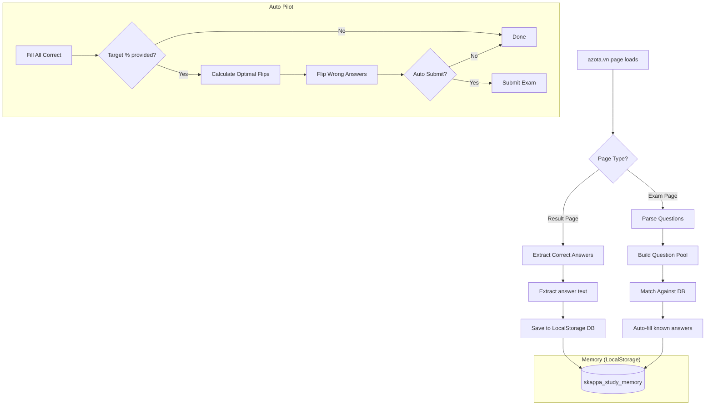
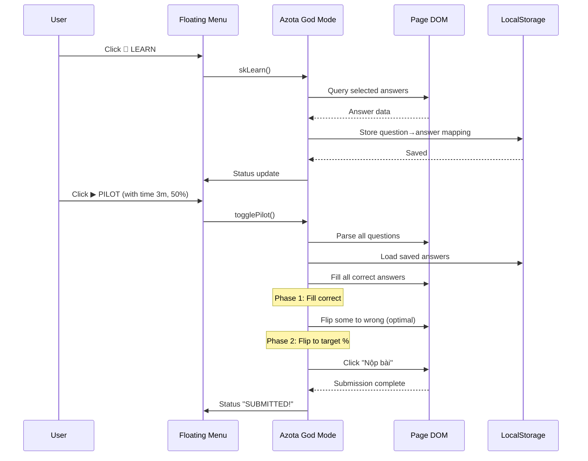

# ⚡ Azota God Mode

[]()
[]()
[](LICENSE)

---

## 🇻🇳 TIẾNG VIỆT

> **Trình script Tampermonkey tự động hoá bài kiểm tra trực tuyến trên [azota.vn](https://azota.vn).**  
> Bao gồm Auto Pilot thông minh, hệ thống ghi nhớ đáp án, công cụ điền nhanh, hỗ trợ Đúng/Sai và Tự luận, phân tích trang kết quả, và giao diện cyberpunk tối giản.

---

### ⚠️ TUYÊN BỐ MIỄN TRỪ TRÁCH NHIỆM PHÁP LÝ (QUAN TRỌNG)

**BẰNG VIỆC SỬ DỤNG SCRIPT NÀY, BẠN ĐỒNG Ý VỚI TẤT CẢ CÁC ĐIỀU KHOẢN SAU ĐÂY. NẾU BẠN KHÔNG ĐỒNG Ý, KHÔNG ĐƯỢC SỬ DỤNG SCRIPT.**

1. **MỤC ĐÍCH GIÁO DỤC**: Script này được tạo ra **CHỈ VÌ MỤC ĐÍCH GIÁO DỤC VÀ NGHIÊN CỨU BẢO MẬT**. Nó là công cụ để sinh viên tìm hiểu về cách thức hoạt động của các nền tảng thi trực tuyến, kiến thức về DOM manipulation, tự động hoá trình duyệt, và các khái niệm bảo mật web.

2. **YÊU CẦU SỰ CHO PHÉP**: Script này **CHỈ ĐƯỢC PHÉP SỬ DỤNG** trên các bài kiểm tra mà bạn đã được giáo viên/giảng viên cho phép sử dụng công cụ hỗ trợ, hoặc trên các bài kiểm tra thực hành/ôn tập không tính điểm. **BẠN PHẢI CÓ SỰ CHO PHÉP RÕ RÀNG TỪ GIÁO VIÊN TRƯỚC KHI SỬ DỤNG.**

3. **MIỄN TRỪ TRÁCH NHIỆM CỦA TÁC GIẢ**: Tác giả (**@skappafrost**) và tất cả những người đóng góp cho dự án này **KHÔNG CHỊU BẤT KỲ TRÁCH NHIỆM PHÁP LÝ NÀO** phát sinh từ việc sử dụng script này, bao gồm nhưng không giới hạn ở:
   - Vi phạm quy chế thi, quy định nhà trường, hoặc quy định pháp luật
   - Bị điểm kém, bị đình chỉ, bị buộc thôi học, hoặc bất kỳ hình thức kỷ luật nào
   - Thiệt hại về học tập, học vị, học hàm, hoặc cơ hội nghề nghiệp
   - Bất kỳ tổn thất trực tiếp, gián tiếp, ngẫu nhiên, hoặc do hậu quả nào

4. **TRÁCH NHIỆM CỦA NGƯỜI DÙNG**: Bạn **HOÀN TOÀN CHỊU TRÁCH NHIỆM** về:
   - Việc đảm bảo bạn có quyền sử dụng script này trên bài kiểm tra cụ thể đó
   - Mọi hậu quả học tập, kỷ luật, hoặc pháp lý phát sinh từ việc sử dụng
   - Việc tuân thủ tất cả quy định của trường học, địa phương, và quốc gia

5. **KHÔNG CÓ BẢO HÀNH**: Script này được cung cấp "NGUYÊN TRẠNG" (AS IS), không có bất kỳ bảo hành nào, dù là rõ ràng hay ngụ ý. Tác giả không đảm bảo script sẽ hoạt động không có lỗi, không bị gián đoạn, hoặc phù hợp với mục đích sử dụng cụ thể của bạn.

6. **SCRIPT CHẠY HOÀN TOÀN TRÊN TRÌNH DUYỆT**: Script này **KHÔNG** can thiệp vào máy chủ của azota.vn, **KHÔNG** hack cơ sở dữ liệu, **KHÔNG** vượt qua xác thực, **KHÔNG** thu thập thông tin cá nhân, và **KHÔNG** gửi dữ liệu ra ngoài trình duyệt của bạn. Toàn bộ dữ liệu được lưu trữ trong **localStorage** của trình duyệt và không bao giờ được truyền qua mạng.

7. **CHỈ SỬ DỤNG CHO MỤC ĐÍCH KIỂM TRA BẢO MẬT**: Script này được tạo ra như một phần của nghiên cứu bảo mật (security research) để kiểm tra khả năng bảo vệ của các nền tảng thi trực tuyến. Bạn chỉ nên sử dụng trên các hệ thống mà bạn đã được cấp quyền kiểm tra bảo mật.

---

### 🧠 TÍNH NĂNG SẮP RA MẮT — AUTO-LEARNING 100%

**Đang phát triển phiên bản mới** với tính năng **Tự động tìm đáp án đúng** thông qua cơ chế:

> 🔄 **Làm bài không giới hạn** (unlimited retry) → 🧠 **Xây dựng bộ nhớ tích luỹ** → ✅ **Giải quyết 100% bài kiểm tra sau một khoảng thời gian**

Cách hoạt động:
1. Script sẽ tự động làm lại bài kiểm tra nhiều lần (nếu nền tảng cho phép làm lại không giới hạn)
2. Sau mỗi lần, script thu thập đáp án từ trang kết quả
3. Bộ nhớ tích luỹ dần dần tất cả các câu hỏi
4. Khi đã đủ dữ liệu, script có thể hoàn thành bài kiểm tra với **điểm số 100%**

**Trạng thái**: Đang trong giai đoạn phát triển — sẽ được phát hành trong phiên bản tương lai.

---

### ✨ Tổng quan

**Azota God Mode** là script Tampermonkey giúp tự động hoá bài kiểm tra trên azota.vn. Cung cấp:

- **Auto Pilot**: Tự động điền và nộp bài với cài đặt thời gian linh hoạt
- **Hệ thống ghi nhớ**: Học đáp án từ trang kết quả, tự động điền lại sau
- **Điền nhanh**: Chọn đáp án một chạm (A/B/C/D, Đúng/Sai, hoặc ngẫu nhiên)
- **Trích xuất đáp án**: Lấy đáp án đúng từ bài kiểm tra đã hoàn thành
- **Đồng bộ dữ liệu**: Xuất/nhập cơ sở dữ liệu đáp án qua file JSON

### 📋 Mục lục (English)

- [Overview](#-overview)
- [Features](#-features)
- [Why This Project Exists](#-why-this-project-exists)
- [How It Works](#-how-it-works)
- [Screenshots](#-screenshots)
- [Requirements](#-requirements)
- [Installation](#-installation)
- [Usage Guide](#-usage-guide)
- [Configuration](#-configuration)
- [Keyboard Shortcuts](#-keyboard-shortcuts)
- [Advanced: Pilot Input Format](#-pilot-input-format)
- [FAQ](#-faq)
- [Troubleshooting](#-troubleshooting)
- [Project Structure](#-project-structure)
- [Technical Architecture](#-technical-architecture)
- [Limitations](#-limitations)
- [Contributing](#-contributing)
- [Credits](#-credits)
- [License](#-license)
---

## ❓ CÂU HỎI THƯỜNG GẶP (Q&A)

### 1. Script có hoạt động trên tất cả các trang của azota.vn không?
Script hoạt động trên tất cả các trang thuộc domain `*.azota.vn`. Tuy nhiên, script chỉ hiển thị menu và hoạt động đầy đủ trên các trang **bài kiểm tra** (exam) và **trang kết quả** (result page). Trên các trang khác như trang chủ, trang thông báo, menu vẫn có thể mở được nhưng không có câu hỏi để xử lý.

### 2. Tại sao script không thấy câu hỏi dù đã vào trang kiểm tra?
Đây là vấn đề thường gặp nhất. Nguyên nhân là do **azota.vn dùng cơ chế lazy-load** — câu hỏi chỉ được tải khi bạn cuộn chuột đến gần chúng.

**Giải pháp**: Trước khi bấm 🧠 LEARN hoặc 🎯 REVIEW, bạn **PHẢI cuộn chuột từ đầu đến cuối trang** để trình duyệt tải toàn bộ DOM (Document Object Model) của bài kiểm tra. Chỉ khi tất cả câu hỏi đã hiển thị trên màn hình, script mới có thể quét và phát hiện được chúng.

Các bước cụ thể:
1. Mở bài kiểm tra
2. **Cuộn chuột từ trên xuống dưới cùng** của trang, đảm bảo bạn đã thấy câu hỏi cuối cùng
3. Cuộn ngược lại lên đầu trang
4. Lúc này mới bấm ` (backtick) để mở menu
5. Bấm 🧠 LEARN hoặc 🎯 REVIEW

> **⚠️ Lưu ý quan trọng**: Nếu bạn chỉ ở đầu trang và bấm LEARN, script chỉ học được những câu hỏi hiện có trên màn hình. Các câu hỏi ở phía dưới chưa được tải vào DOM nên script không thể nhìn thấy chúng. Hãy luôn cuộn hết trang trước khi sử dụng bất kỳ chức năng nào của script.

### 3. Làm sao để biết script đã hoạt động?
Khi script hoạt động, bạn sẽ thấy:
- Một menu nổi màu xanh đen ở góc phải màn hình (sau khi bấm phím ` (backtick) — phím bên trên phím Tab)
- Menu có tiêu đề **⚡SKAPPA v15.3**
- Dòng trạng thái ở cuối menu hiển thị thông báo
- Các nút bấm có hiệu ứng hover (đổi màu, phát sáng)

### 4. Tại sao bấm nút LEARN không thấy tăng số lượng câu đã học?
Có thể do:
- **Chưa cuộn trang để tải hết DOM** (xem câu 2 ở trên)
- **Chưa chọn đáp án nào** — LEARN trên trang kiểm tra chỉ học những câu bạn đã chọn đáp án
- **Đang ở trang không có câu hỏi** — script không tìm thấy element câu hỏi nào
- **azota.vn đã thay đổi cấu trúc HTML** — các selector cũ không còn hoạt động

### 5. LEARN trên trang kết quả (result page) khác gì LEARN trên trang kiểm tra?
- **Trên trang kiểm tra**: LEARN sẽ học **đáp án bạn đã chọn** (có thể đúng hoặc sai)
- **Trên trang kết quả**: LEARN sẽ trích xuất **đáp án đúng** từ đáp án của giáo viên. Hỗ trợ trắc nghiệm, Đúng/Sai và Tự luận

Script tự động phát hiện loại trang và điều chỉnh hành vi phù hợp. Khi ở trang kết quả, tiêu đề menu sẽ đổi thành **⚡SKAPPA RESULT**.

### 6. Tại sao Pilot (Auto Pilot) không hoạt động trên trang kết quả?
Pilot được thiết kế **chỉ hoạt động trên trang kiểm tra**. Trên trang kết quả, nút Pilot sẽ hiển thị thông báo "Pilot not available on result page!" vì không có câu hỏi nào để điền.

### 7. Dữ liệu đã học có bị mất khi tắt trình duyệt không?
**Không.** Dữ liệu được lưu trong **localStorage** của trình duyệt — nó tồn tại ngay cả khi bạn:
- Tắt trình duyệt
- Khởi động lại máy tính
- Đóng tab azota.vn

Dữ liệu chỉ bị mất nếu bạn:
- Xóa lịch sử trình duyệt (chọn "Xóa dữ liệu trang web")
- Bấm nút **🗑 CLEAR** trong menu
- Vào DevTools (F12) → Application → Clear Storage

### 8. Làm sao để chuyển dữ liệu đã học sang máy tính khác?
Sử dụng tính năng Xuất/Nhập:
1. Trên máy A: Bấm **⬇ EXPORT** → tải file `skappa_azota_backup.json`
2. Gửi file đó sang máy B (email, USB, cloud...)
3. Trên máy B (đã cài script): Bấm **⬆ IMPORT** → chọn file → dữ liệu được gộp vào

### 9. Script có ảnh hưởng đến tốc độ trang web không?
Script rất nhẹ — chỉ khoảng 50KB sau khi nén. Nó không gọi API bên ngoài, không gửi dữ liệu đi đâu, và chỉ chạy khi bạn tương tác với menu hoặc bấm nút. Bạn sẽ không thấy bất kỳ sự khác biệt nào về tốc độ tải trang.

### 10. Tôi có thể đóng góp ý kiến hoặc báo lỗi ở đâu?
Bạn có thể:
- Mở [GitHub Issue](https://github.com/skappafrost/azota-god-mode/issues) để báo lỗi hoặc đề xuất tính năng
- Xem mã nguồn tại `src/azota-god-mode.user.js`
- Đọc hướng dẫn đóng góp tại [CONTRIBUTING.md](CONTRIBUTING.md)

### 11. Script có hoạt động trên điện thoại không?
Có, nhưng chỉ trên **Kiwi Browser** (Android) vì nó hỗ trợ extension Tampermonkey. Trên iOS (Safari) không hỗ trợ Tampermonkey nên script không hoạt động.

### 12. Tôi có thể tuỳ chỉnh giao diện menu không?
Hiện tại chưa có tính năng tuỳ chỉnh giao diện. Tuy nhiên, bạn có thể **kéo thả menu** đến bất kỳ vị trí nào trên màn hình — vị trí sẽ được lưu lại sau khi reload trang.

### 13. Làm sao để tắt script tạm thời?
Có 2 cách:
- **Cách 1 (nhanh)**: Click icon Tampermonkey 🎭 trên thanh toolbar → Toggle switch để tắt script
- **Cách 2 (tạm thời)**: Bấm phím ` (backtick) để ẩn menu — script vẫn chạy ngầm nhưng không gây khó chịu

### 14. Script có thể bị phát hiện không?
Script chạy hoàn toàn trong trình duyệt của bạn, không gửi dữ liệu đi đâu, không thay đổi URL, không gọi API lạ. Nó tương tác với trang web giống hệt như một người dùng bình thường — click chuột, điền text, chọn đáp án. Vì vậy **rất khó bị phát hiện** từ phía máy chủ.

> **Lưu ý**: Dù khó bị phát hiện, việc sử dụng script vẫn có thể vi phạm quy chế thi của trường bạn. Hãy đảm bảo bạn đã được sự cho phép của giáo viên.

---

## 📖 HƯỚNG DẪN CHI TIẾT (TIẾNG VIỆT)

Hướng dẫn từ A đến Z cho người mới bắt đầu. Làm theo từng bước để sử dụng script thành công.

---

### Phần 1: Cài đặt Môi Trường

#### Bước 1.1 — Kiểm tra trình duyệt
Script này yêu cầu trình duyệt có hỗ trợ cài extension. Các trình duyệt được khuyến nghị:
- ✅ **Google Chrome** (bản 100+)
- ✅ **Microsoft Edge** (bản 100+)
- ✅ **Brave Browser**
- ✅ **Firefox** (bản 100+)
- ✅ **Opera**
- ⚠️ **Kiwi Browser** (Android) — có hỗ trợ nhưng giao diện nhỏ

#### Bước 1.2 — Cài đặt Tampermonkey

**Trên Chrome / Edge / Brave:**
1. Mở Chrome Web Store: https://chrome.google.com/webstore/detail/tampermonkey/dhdgffkkebhmkfjojejmpbldmpobfkfo
2. Bấm **"Thêm vào Chrome"** (Add to Chrome)
3. Bấm **"Thêm extension"** trong cửa sổ pop-up
4. Sau khi cài xong, bạn sẽ thấy icon Tampermonkey (🎭) xuất hiện trên thanh toolbar (góc phải trên cùng)
5. Nếu không thấy icon, bấm icon puzzle (🧩) → ghim Tampermonkey lên toolbar

**Trên Firefox:**
1. Mở Firefox Add-ons: https://addons.mozilla.org/vi/firefox/addon/tampermonkey/
2. Bấm **"Thêm vào Firefox"**
3. Bấm **"Thêm"** trong cửa sổ pop-up

**Trên Android (Kiwi Browser):**
1. Cài [Kiwi Browser](https://play.google.com/store/apps/details?id=com.kiwibrowser.browser) từ Google Play
2. Mở Chrome Web Store ngay trong Kiwi Browser
3. Cài Tampermonkey như trên Chrome

#### Bước 1.3 — Kiểm tra Tampermonkey đã hoạt động
1. Bấm icon 🎭 trên toolbar
2. Bạn sẽ thấy bảng điều khiển (Dashboard) với danh sách script đã cài
3. Nếu là lần đầu, danh sách sẽ trống

---

### Phần 2: Cài đặt Script

#### Cách A — Cài từ GitHub (khuyến nghị)
1. Mở link này trong trình duyệt: `https://github.com/skappafrost/azota-god-mode`
2. Vào thư mục `src/`
3. Bấm vào file `azota-god-mode.user.js`
4. Bấm nút **"Raw"** (góc phải trên cùng của mã nguồn)
5. Tampermonkey sẽ tự động nhận diện và hiển thị trang cài đặt
6. Bấm **"Install"** (Cài đặt)

#### Cách B — Cài từ URL
1. Bấm icon 🎭 → **"Dashboard"**
2. Bấm tab **"Utilities"** (Tiện ích)
3. Trong ô "Install from URL", dán link:
   ```
   https://raw.githubusercontent.com/skappafrost/azota-god-mode/main/src/azota-god-mode.user.js
   ```
4. Bấm **"Install"**
5. Xác nhận cài đặt

#### Cách C — Copy-Paste thủ công
1. Bấm icon 🎭 → **"Dashboard"**
2. Bấm **"Create a new script"** (Tạo script mới)
3. Xoá toàn bộ code mẫu có sẵn
4. Mở file `azota-god-mode.user.js` từ GitHub và copy toàn bộ nội dung
5. Dán vào ô soạn thảo
6. Bấm **Ctrl+S** (hoặc **Cmd+S** trên Mac) để lưu
7. Đặt tên cho script (tuỳ chọn), ví dụ: "Azota God Mode"

---

### Phần 3: Kích Hoạt Script

#### Bước 3.1 — Kiểm tra script đã được bật
1. Bấm icon 🎭 → **"Dashboard"**
2. Tìm script "Azota God Mode" trong danh sách
3. Đảm bảo công tắc bên cạnh tên script ở trạng thái **ON** (màu xanh)
4. Nếu là OFF (màu xám), bấm vào công tắc để bật

#### Bước 3.2 — Vào trang azota.vn
1. Mở tab mới và điều hướng đến `https://azota.vn`
2. Đăng nhập vào tài khoản của bạn
3. Vào bài kiểm tra bất kỳ

#### Bước 3.3 — Mở menu script
1. Trên trang bài kiểm tra, bấm phím ` (backtick)
   - Phím này nằm **bên trên phím Tab**, bên trái phím số 1
   - Trên bàn phím tiếng Việt, nó thường là phím **`** (dấu huyền)
2. Menu script sẽ hiện ra ở **góc phải trên cùng** của màn hình
3. Nếu menu không hiện, thử **bấm phím ` nhiều lần** hoặc **reload trang**

---

### Phần 4: Sử Dụng Cơ Bản

#### Bước 4.1 — Tải toàn bộ câu hỏi (rất quan trọng)

> **⚠️ BẮT BUỘC: Phải cuộn hết trang trước khi sử dụng script!**

Azota.vn sử dụng kỹ thuật **lazy-load** — câu hỏi chỉ được tải vào DOM khi bạn cuộn đến gần chúng. Nếu bạn không cuộn trang, script chỉ nhìn thấy 5-10 câu đầu tiên.

**Cách thực hiện:**
1. Mở bài kiểm tra
2. **Cuộn chuột chậm từ trên xuống dưới cùng** của trang
3. Đảm bảo bạn đã nhìn thấy câu hỏi cuối cùng
4. **Cuộn ngược lại lên đầu trang** (để tiện theo dõi)
5. Bấm phím ` để mở menu script
6. Lúc này mới bắt đầu sử dụng các tính năng

**Kiểm tra đã tải hết chưa:**
- Bấm **📋 LOG** trong menu
- Mở Console (F12) → xem số lượng key trong database
- Nếu số lượng ít hơn số câu hỏi thực tế, bạn chưa cuộn đủ

#### Bước 4.2 — Học đáp án từ trang kết quả (quan trọng nhất)

**Tình huống:** Bạn vừa nộp bài và thấy điểm. Trang kết quả hiển thị đáp án đúng.

**Các bước:**
1. Đảm bảo bạn đang ở trang kết quả (URL có `/answer-test/` hoặc có chữ "Kết quả")
2. **Cuộn hết trang** để tải toàn bộ câu hỏi và đáp án vào DOM
3. Bấm phím ` để mở menu — tiêu đề sẽ hiện **⚡SKAPPA RESULT**
4. Bấm **🧠 LEARN**
5. Quan sát dòng trạng thái: "Learned X answers from result page!"
6. Số X là số câu hỏi đã được học thành công

**Giải thích:** Script quét từng câu hỏi trên trang kết quả, tìm đáp án đúng (multiple choice: chữ cái A-D, Đúng/Sai: từng mục a-b-c-d, Tự luận: nội dung trong dấu ngoặc), và lưu vào localStorage.

#### Bước 4.3 — Tự động điền đáp án đã học

**Tình huống:** Bạn đã học từ trang kết quả (bước 4.2), bây giờ mở bài kiểm tra mới có cùng câu hỏi.

**Các bước:**
1. Mở bài kiểm tra mới
2. **Cuộn hết trang** để tải toàn bộ câu hỏi
3. Bấm phím ` mở menu
4. Bấm **🎯 REVIEW**
5. Các câu đã có đáp án trong bộ nhớ sẽ được **tự động chọn** và **tô màu xanh lá**
6. Dòng trạng thái: "Auto-filled X matches!"

**Lưu ý:** Script so khớp câu hỏi dựa trên nội dung (có sử dụng fuzzy matching). Nếu câu hỏi giống nhau 60% trở lên, script sẽ tự động điền.

#### Bước 4.4 — Điền đáp án nhanh (khi chưa có bộ nhớ)

**Chọn đáp án theo chữ cái:**
1. Bấm nút **A**, **B**, **C**, hoặc **D** trong phần "Quick Fill"
2. Tất cả câu trắc nghiệm sẽ được chọn đáp án tương ứng
3. Câu Đúng/Sai và Tự luận sẽ được bỏ qua

**Chọn ngẫu nhiên:**
1. Bấm nút **🎲 RANDOM**
2. Mỗi câu hỏi sẽ được chọn một đáp án ngẫu nhiên (A/B/C/D)
3. Câu Đúng/Sai: random Đúng hoặc Sai
4. Câu Tự luận: điền số ngẫu nhiên

**Điền theo mẫu (Pattern):**
1. Nhập mẫu vào ô Pattern, ví dụ: `ABCD`
2. Bấm **▶ RUN** (hoặc bấm Pattern Run)
3. Câu 1→A, Câu 2→B, Câu 3→C, Câu 4→D, Câu 5→A...

#### Bước 4.5 — Điền Đúng/Sai nhanh

1. Bấm **✓ DUNG** → tất cả câu Đúng/Sai được chọn "Đúng"
2. Bấm **✗ SAI** → tất cả câu Đúng/Sai được chọn "Sai"
3. Bấm **TF PTN** → điền theo mẫu Pattern (A/C = Đúng, B/D = Sai)
4. Bấm **ESSAY** → điền số ngẫu nhiên vào các câu tự luận

---

### Phần 5: Sử Dụng Auto Pilot (Nâng Cao)

#### Bước 5.1 — Chuẩn bị
1. Đảm bảo bạn đã học đáp án (🧠 LEARN) ít nhất một lần
2. Mở bài kiểm tra cần làm
3. **Cuộn hết trang** để tải toàn bộ câu hỏi
4. Mở menu script

#### Bước 5.2 — Cấu hình Pilot
Nhập chuỗi cấu hình vào ô input ở hàng "Autopilot". Định dạng:

```
<thời_gian>,<phần_trăm>,<tự_động_nộp>,<công_thức_tf>
```

**Ví dụ cụ thể:**
- `0` — không giới hạn thời gian, điền tất cả đúng (mặc định)
- `30` — mỗi câu 30 giây, tổng thời gian = số câu x 30s
- `3m43` — tổng thời gian 3 phút 43 giây
- `3m43,50` — 3m43, mục tiêu đạt 50% số điểm
- `30,80,1,equal` — 30s/câu, 80%, tự động nộp, công thức TF đều

#### Bước 5.3 — Chạy Pilot
1. Sau khi nhập cấu hình, bấm **▶ PILOT**
2. Nút sẽ đổi thành **■ PILOT** và chuyển màu đỏ
3. Menu sẽ có viền đỏ — dấu hiệu Pilot đang chạy
4. Quan sát dòng trạng thái để theo dõi tiến trình:
   - "Fill 5/20 (25%) 2m30s left" — đang điền câu đúng
   - "Flip 3/15 (20%) 1m45s left" — đang đổi sang đáp án sai (nếu có mục tiêu %)

#### Bước 5.4 — Tạm dừng và Tiếp tục
- Bấm **■ PILOT** lần nữa → Pilot tạm dừng, lưu trạng thái
- Bấm **▶ PILOT** → Pilot tiếp tục từ vị trí đã dừng
- **Lưu ý**: Tính năng Pause/Resume chỉ hoạt động khi bạn đã đặt mục tiêu % (vì cần lưu trạng thái trung gian)

#### Bước 5.5 — Kết thúc
- Khi hết thời gian hoặc hoàn thành, Pilot sẽ dừng
- Nếu bạn đặt `autoSubmit=1`, script sẽ tự động bấm nút "Nộp bài"
- Script có cơ chế an toàn: nếu dưới 50% câu hỏi được trả lời, nó sẽ hỏi bạn xác nhận trước khi nộp

---

### Phần 6: Quản Lý Dữ Liệu

#### Bước 6.1 — Xuất dữ liệu
1. Bấm **⬇ EXPORT**
2. File `skappa_azota_backup.json` sẽ được tải về
3. File này chứa toàn bộ đáp án đã học

#### Bước 6.2 — Nhập dữ liệu
1. Trên máy khác, bấm **⬆ IMPORT**
2. Chọn file `.json` đã xuất
3. Dữ liệu sẽ được **gộp** vào bộ nhớ hiện tại (không ghi đè)
4. Thông báo: "Đồng bộ file thành công! Đã nạp X câu hỏi."

#### Bước 6.3 — Xem dữ liệu
1. Bấm **📋 LOG**
2. Mở Console (F12)
3. Bạn sẽ thấy toàn bộ database dưới dạng Object
4. Cấu trúc: `{ "question_id": "normalized_answer", ... }`

#### Bước 6.4 — Xoá dữ liệu
1. Bấm **🗑 CLEAR**
2. Xác nhận "Xóa toàn bộ đáp án đã học?"
3. Toàn bộ dữ liệu bị xoá vĩnh viễn

---

### Phần 7: Phím Tắt

| Phím tắt | Hành động | Ghi chú |
|----------|-----------|---------|
| ` (Backtick) | Mở/Ẩn menu | Phím trên Tab, bên trái số 1 |
| **Alt + L** | Học đáp án | LEARN |
| **Alt + R** | Xem lại/Tô màu | REVIEW |
| **Alt + P** | Bật/Tắt Pilot | TOGGLE PILOT |
| **Alt + S** | Nộp bài | SUBMIT |

**Mẹo**: Kết hợp **Alt + L** sau đó **Alt + R** là cách nhanh nhất để học và điền lại.

---

### Phần 8: Xử Lý Sự Cố

#### Vấn đề 1: Menu không hiện
Nguyên nhân: Chưa bấm phím tắt, hoặc script chưa được bật
Cách xử lý:
1. Bấm phím ` (backtick) nhiều lần
2. Click icon 🎭 → Dashboard → kiểm tra script đã bật
3. Reload trang F5
4. Vào Console F12 → xem có lỗi gì không

#### Vấn đề 2: LEARN học được 0 câu
Nguyên nhân: Chưa cuộn trang, hoặc không có đáp án nào được chọn
Cách xử lý:
1. Cuộn từ đầu đến cuối trang
2. Đảm bảo bạn đã chọn ít nhất một đáp án
3. Nếu ở trang kết quả: đảm bảo đáp án đúng đã hiển thị
4. Thử bấm LEARN nhiều lần

#### Vấn đề 3: REVIEW không điền được câu nào
Nguyên nhân: Bộ nhớ trống, hoặc không có câu hỏi trùng khớp
Cách xử lý:
1. Kiểm tra đã LEARN từ trang kết quả chưa (bấm 📋 LOG)
2. Đảm bảo câu hỏi có nội dung tương tự
3. Cuộn hết trang trước khi REVIEW

#### Vấn đề 4: Pilot báo "No answerable questions found"
Nguyên nhân: Chưa học đáp án nào
Cách xử lý:
1. Học đáp án từ trang kết quả trước (🧠 LEARN)
2. Kiểm tra bộ nhớ (📋 LOG)
3. Thử REVIEW trước khi chạy Pilot

#### Vấn đề 5: Nút "Nộp bài" không tìm thấy
Nguyên nhân: Azota.vn có thể đã đổi tên nút
Cách xử lý:
1. Bấm nộp bài thủ công
2. Báo lỗi qua GitHub Issues

#### Vấn đề 6: Script không chạy trên trang azota.vn
Nguyên nhân: Extension Tampermonkey chưa được cấp quyền
Cách xử lý:
1. Click icon 🎭 → Dashboard
2. Kiểm tra script có trong danh sách không
3. Kiểm tra cột "Enabled" — phải có dấu ✓
4. Vào tab "Settings" → "Includes/Excludes" → đảm bảo `*.azota.vn` nằm trong danh sách

#### Vấn đề 7: Bị treo trình duyệt khi dùng Pilot
Nguyên nhân: Số câu hỏi quá lớn hoặc cấu hình thời gian không hợp lý
Cách xử lý:
1. Reload trang
2. Giảm số lượng câu hỏi (nếu có thể)
3. Tăng khoảng thời gian giữa các câu
4. Nếu vẫn treo, tắt script và báo lỗi

---

### Phần 9: Các Lưu Ý Quan Trọng

#### Về kỹ thuật
- Script chạy hoàn toàn trên trình duyệt — **không ảnh hưởng đến máy chủ azota.vn**
- Dữ liệu lưu trong **localStorage** — dung lượng tối đa khoảng 5-10MB, đủ cho hàng nghìn câu hỏi
- Script sử dụng **setInterval** để phát hiện thay đổi DOM
- Các thao tác click được thực hiện qua **synthetic MouseEvent** — giống hệt click thật

#### Về bảo mật
- **Không gửi dữ liệu đi đâu** — không có API call, không có tracking
- **Không thu thập thông tin cá nhân** — không đọc cookie, không đọc session
- **Mã nguồn mở** — bạn có thể kiểm tra toàn bộ code
- **Chạy trong sandbox của Tampermonkey** — không thể truy cập file hệ thống

#### Về phiên bản tương lai
Phiên bản tiếp theo (v16.0) sẽ có:
- **Auto-Learning**: Tự động làm lại bài, thu thập đáp án, tích luỹ bộ nhớ đến khi đạt 100%
- **Smart Pattern Detection**: Phát hiện mẫu đáp án từ dữ liệu lịch sử
- **Multi-exam Support**: Quản lý nhiều bài kiểm tra cùng lúc
- **Cloud Sync**: Đồng bộ dữ liệu qua nhiều thiết bị (tuỳ chọn, không bắt buộc)
- **UI Themes**: Nhiều giao diện màu sắc hơn

---

---

## 🇬🇧 ENGLISH

> **A powerful Tampermonkey userscript for automating online exams on [azota.vn](https://azota.vn).**  
> Includes an intelligent Auto Pilot system, memory-based answer recall, quick-fill tools, support for True/False and Essay questions, result page analysis, and a sleek cyberpunk dark UI.

---

### ⚠️ LEGAL DISCLAIMER (IMPORTANT)

**BY USING THIS SCRIPT, YOU AGREE TO ALL OF THE FOLLOWING TERMS. IF YOU DO NOT AGREE, DO NOT USE THE SCRIPT.**

1. **EDUCATIONAL PURPOSE ONLY**: This script is created **SOLELY FOR EDUCATIONAL AND SECURITY RESEARCH PURPOSES**. It is a tool for students to learn about how online exam platforms work, DOM manipulation, browser automation, and web security concepts.

2. **PERMISSION REQUIRED**: This script **MAY ONLY BE USED** on exams where you have been explicitly granted permission by your teacher/instructor to use assistive tools, or on practice/review exams that do not count toward your grade. **YOU MUST HAVE CLEAR PERMISSION FROM YOUR TEACHER BEFORE USE.**

3. **NO LIABILITY**: The author (**@skappafrost**) and all contributors to this project **ASSUME NO LIABILITY WHATSOEVER** arising from the use of this script, including but not limited to:
   - Violation of exam rules, school policies, or applicable laws
   - Academic penalties, suspension, expulsion, or any form of disciplinary action
   - Loss of academic credit, degree, or professional opportunities
   - Any direct, indirect, incidental, or consequential damages

4. **USER RESPONSIBILITY**: You **ASSUME FULL RESPONSIBILITY** for:
   - Ensuring you have the right to use this script on the specific exam
   - Any and all academic, disciplinary, or legal consequences
   - Compliance with all applicable school, local, and national regulations

5. **NO WARRANTY**: This script is provided "AS IS" without any warranty, express or implied. The author does not guarantee that the script will be error-free, uninterrupted, or fit for any particular purpose.

6. **CLIENT-SIDE ONLY**: This script **DOES NOT** interfere with azota.vn servers, **DOES NOT** hack databases, **DOES NOT** bypass authentication, **DOES NOT** collect personal information, and **DOES NOT** transmit data outside your browser. All data is stored in your browser's **localStorage** and is never transmitted over the network.

7. **SECURITY TESTING ONLY**: This script was created as part of security research to test the protection mechanisms of online exam platforms. You should only use it on systems for which you have been explicitly granted security testing authorization.

---

### 🧠 UPCOMING FEATURE — AUTO-LEARNING 100%

**Next version in development** with the ability to **automatically discover all correct answers** through:

> 🔄 **Unlimited retry** → 🧠 **Build cumulative memory** → ✅ **Solve 100% of the exam over time**

How it works:
1. The script will automatically re-take the exam multiple times (if the platform allows unlimited retries)
2. After each attempt, it collects answers from the result page
3. Memory accumulates all questions and answers over time
4. When enough data is collected, the script can achieve **100% accuracy**

**Status**: Under development — will be released in a future version.

---

## 🚀 Overview

**Azota God Mode** is a Tampermonkey/Greasemonkey userscript that enhances the [azota.vn](https://azota.vn) online exam platform with automation capabilities. It provides:

- **Auto Pilot**: Automatically fill and submit exams with configurable timing
- **Memory System**: Learn correct answers from result pages, recall them later
- **Quick Fill**: One-click answer selection (A/B/C/D, True/False, or random)
- **Answer Extraction**: Extract correct answers from completed exam result pages
- **Data Sync**: Export/import answer databases via JSON files

The script operates **entirely client-side** — no data leaves your browser except what you explicitly export.

---

## ✨ Features

### 🧠 Memory System
| Feature | Description |
|---------|-------------|
| **Learn** | Capture selected answers from the current exam page into local memory |
| **Review** | Auto-fill questions using previously saved answers |
| **Learn from Results** | Extract correct answers from completed test result pages |
| **Highlight on Results** | Highlight matched answers on result review pages |
| **Export/Import** | Save your answer database as a JSON file or restore it later |

### 🤖 Auto Pilot
| Feature | Description |
|---------|-------------|
| **Time-based** | Set a specific time limit (e.g. 3m43s for a 3-minute 43-second exam) |
| **Target-based** | Specify a target score percentage (e.g. 80%) with optimal wrong-answer flipping |
| **Formula-aware** | Supports custom T/F scoring formulas (`equal`, `tapered`, or custom) |
| **Auto-submit** | Automatically submits the exam when finished |
| **Pause/Resume** | Stop and resume the pilot while preserving state |

### ⚡ Quick Fill
| Feature | Description |
|---------|-------------|
| **A/B/C/D** | Fill a specific answer letter across all multiple choice questions |
| **Random** | Fill all questions with random answers |
| **Pattern** | Fill answers following a custom pattern string (e.g. "ABCD", "AABB") |
| **Đúng/Sai** | Fill all True/False questions with Đúng or Sai |
| **TF Pattern** | Apply pattern-based filling to True/False questions (A/C = Đúng, B/D = Sai) |
| **Essay Draft** | Fill essay questions with random numeric drafts |

### 🎨 User Interface
- Cyberpunk dark emerald theme with glass-morphism effects
- Draggable floating menu
- Keyboard shortcuts (toggle with backtick `` ` ``)
- Status bar with real-time operation feedback
- Smooth hover and click animations

---

## 🤔 Why This Project Exists

Azota.vn is widely used by Vietnamese schools and universities for online testing. Students often need to:

1. **Review past exams** — Manually cross-referencing answers from a result page back to the exam is tedious
2. **Manage time** — During timed exams, manually selecting answers eats into thinking time
3. **Practice efficiently** — Quickly filling in known answers and focusing only on unfamiliar questions

This script was created as a **productivity tool** — not for cheating, but for **legitimate exam preparation and review** where the user already has access to the material.

---

## 🏗️ How It Works (High-Level Architecture)



### Internal Workflow



---

## 📸 Screenshots

### Floating Menu
```
┌─────────────────────┐
│ ⚡SKAPPA v15.3      │ ← Drag to move
├─────────────────────┤
│ AUTOPILOT           │
│ [▶ PILOT] [   ] i │
├─────────────────────┤
│ MEMORY              │
│ [🧠 LEARN] [🎯 REVIEW]│
│ [⬇ EXPORT] [⬆ IMPORT]│
│ [📋 LOG] [🗑 CLEAR]  │
├─────────────────────┤
│ QUICK FILL          │
│ [A] [B] [C] [D]     │
│ [🎲 RANDOM] [🚀 SUBMIT]│
├─────────────────────┤
│ DUNG/SAI            │
│ [✓ DUNG] [✗ SAI]    │
│ [TF PTN] [ESSAY]   │
├─────────────────────┤
│ PATTERN             │
│ [ABCD           ] ▶│
├─────────────────────┤
│ ■ Hidden · ` show   │
└─────────────────────┘
```

---

## 📦 Requirements

- **Browser**: Chrome, Firefox, Edge, or any browser that supports Tampermonkey
- **Extension**: [Tampermonkey](https://www.tampermonkey.net/) (recommended) or Greasemonkey / Violentmonkey
- **Network**: Access to `*.azota.vn`
- **OS**: Windows, macOS, Linux, or Android (with Kiwi Browser + Tampermonkey)

---

## 🔧 Installation

### Step 1: Install Tampermonkey

<details>
<summary><b>Chrome / Edge / Brave</b></summary>

1. Visit the [Chrome Web Store](https://chrome.google.com/webstore/detail/tampermonkey/dhdgffkkebhmkfjojejmpbldmpobfkfo)
2. Click **"Add to Chrome"**
3. Click **"Add Extension"** in the popup
4. You should see the Tampermonkey icon (🎭) appear in your toolbar

</details>

<details>
<summary><b>Firefox</b></summary>

1. Visit the [Firefox Add-ons page](https://addons.mozilla.org/en-US/firefox/addon/tampermonkey/)
2. Click **"Add to Firefox"**
3. Click **"Add"** in the popup

</details>

<details>
<summary><b>Android (Kiwi Browser)</b></summary>

1. Install [Kiwi Browser](https://play.google.com/store/apps/details?id=com.kiwibrowser.browser) from Google Play
2. Install Tampermonkey from [Chrome Web Store](https://chrome.google.com/webstore/detail/tampermonkey/dhdgffkkebhmkfjojejmpbldmpobfkfo) (works on Kiwi)
3. Follow the same steps as Chrome

</details>

### Step 2: Install the Script

**Option A — Install from GitHub (recommended)**

1. Navigate to [`src/azota-god-mode.user.js`](src/azota-god-mode.user.js) in this repository
2. Click the **Raw** button (or open the raw file URL)
3. Tampermonkey should automatically detect the userscript and show an installation page
4. Click **"Install"**

**Option B — Manual Installation**

1. Open Tampermonkey dashboard (click 🎭 → "Dashboard")
2. Click **"Create a new script"**
3. Delete all default template code
4. Copy the entire contents of `src/azota-god-mode.user.js`
5. Paste into the editor
6. Press **Ctrl+S** (or **Cmd+S**) to save

### Step 3: Verify Installation

1. Navigate to any page on `https://azota.vn`
2. Press the **backtick** key (`) `` ` `` — usually above the Tab key)
3. The floating menu should appear in the top-right corner
4. If nothing happens, refresh the page and try again

---

## 📖 Usage Guide

### Basic Workflow

#### 1. Learning Answers from a Result Page
```
1. After submitting an exam, you see the result page
2. Press ` (backtick) to open the menu
3. Click "🧠 LEARN" — the script extracts all correct answers
4. Status shows: "Learned X answers from result page!"
5. The answers are saved to your browser's localStorage
```

#### 2. Reviewing/Auto-filling on an Exam
```
1. Open a new exam that has the same questions
2. Press ` to open the menu
3. Click "🎯 REVIEW"
4. The script matches questions against saved answers
5. Matched answers are auto-selected and highlighted green
6. Status shows: "Auto-filled X matches!"
```

#### 3. Using Auto Pilot
```
1. On an exam page, open the menu
2. In the pilot input field, enter your configuration (see below)
3. Click "▶ PILOT"
4. The script fills all known answers and manages timing
5. When done (or time expires), it auto-submits if configured
```

### Pilot Input Examples

| Input | Meaning |
|-------|---------|
| `30` | Fill all answers instantly, 30 seconds between each question |
| `3m43` | Total time 3 minutes 43 seconds |
| `3m43,50` | 3m43 total, target 50% score |
| `30,80,1,equal` | 30s per item, 80% target, auto-submit, equal T/F scoring |
| `,80` | No time limit, target 80% |
| `30,0` | 30s per item, score 0 (all wrong answers deliberately) |
| `,50,0,tapered` | No time, 50% target, manual submit, tapered T/F scoring |

### Export/Import Data

```
EXPORT: Click "⬇ EXPORT" → downloads skappa_azota_backup.json
IMPORT: Click "⬆ IMPORT" → select a backup .json file → merges into current DB
```

---

## ⚙️ Configuration

### Pilot Input Format

The pilot input box accepts a comma-separated string with up to 4 fields:

```
<time>,<percent>,<submit>,<formula>
```

| Field | Position | Values | Description |
|-------|----------|--------|-------------|
| **time** | 1 | `30` / `3m43` / `2h` / empty | Time limit — empty = no limit |
| **percent** | 2 | `0`–`100` or empty | Target score percentage |
| **submit** | 3 | `1` (yes) / `0` (no) | Auto-submit when done |
| **formula** | 4 | `equal` / `tapered` / `0.1;0.3;0.5;1` | T/F scoring formula |

### T/F Scoring Formulas

| Formula | Values | Description |
|---------|--------|-------------|
| `equal` | `[0.25, 0.5, 0.75, 1]` | Each correct sub-item gives equal points |
| `tapered` | `[0.1, 0.25, 0.5, 1]` | Later sub-items give more points |
| Custom | `0.1;0.3;0.5;1` | Use up to 4 semicolon-separated values |

### Pattern String

The pattern field controls how answers are filled in pattern modes:
- Format: uppercase letters without spaces (e.g. `ABCD`, `AABB`, `DCBA`)
- Each character maps to answer choice A=0, B=1, C=2, D=3
- Pattern repeats cyclically across questions

---

## ⌨️ Keyboard Shortcuts

| Key | Action |
|-----|--------|
| **`** (Backtick) | Toggle menu visibility |
| **Alt + L** | Learn answers |
| **Alt + R** | Review / auto-fill |
| **Alt + P** | Toggle Pilot |
| **Alt + S** | Submit exam |

---

## 📄 Project Structure

```
azota-god-mode/
├── src/
│   └── azota-god-mode.user.js   # The main userscript (installed via Tampermonkey)
├── docs/
│   ├── usage.md                  # Detailed usage documentation
│   ├── architecture.md           # Technical architecture deep-dive
│   └── troubleshooting.md        # Common issues and fixes
├── assets/
│   └── preview.png               # Screenshot / preview image
├── .github/
│   └── ISSUE_TEMPLATE/
│       ├── bug_report.md         # Bug report template
│       └── feature_request.md    # Feature request template
├── .gitignore
├── CHANGELOG.md
├── CONTRIBUTING.md
├── LICENSE                       # MIT License
├── package.json                  # npm metadata
├── README.md                     # This file
└── SECURITY.md                   # Security policy
```

---

## 🧠 Technical Architecture

### Memory Layer

```
┌─────────────────────────────────────────────┐
│              skappa_study_memory             │
│  (localStorage - persists across sessions)  │
├─────────────────────────────────────────────┤
│  Key Format:                                 │
│  - Multiple choice: <question_id>            │
│  - True/False:    <question_id>_<letter>     │
│  - Essay:         <question_id>              │
├─────────────────────────────────────────────┤
│  Value: normalized answer text               │
└─────────────────────────────────────────────┘
```

### Question Detection

The script uses multiple selectors to detect questions, handling various DOM layouts:

- `.azt-question` — Standard exam page questions
- `.question-standalone-box` — Result page questions
- `.question-standalone-content-box` — Alternative result page format
- `.question-item` — Legacy layout
- `div[data-order]` — Generic ordered containers

### Fuzzy Matching

When comparing student answers against saved answers, the script uses a multi-strategy approach:

1. **Exact match**: `normalize(a) === normalize(b)`
2. **Substring match**: One contains the other
3. **Character overlap**: >60% of characters match

This handles minor formatting differences, extra whitespace, and partial text matches.

---

## ⚠️ Limitations

- **Client-side only**: Cannot access answers not present in the page DOM
- **DOM-dependent**: Changes to azota.vn's HTML structure may break question detection
- **No server bypass**: Does not hack into databases or bypass authentication
- **Text area essay**: Only works with `<textarea>` elements — rich text editors may not be supported
- **Score calculation**: T/F score calculation is an **estimate** based on visible DOM state
- **Mobile browsers**: Full functionality requires Tampermonkey (Kiwi Browser on Android)

---

## ❓ FAQ

### Is this cheating?

This script is a **productivity tool**. When used to auto-fill answers you already know (from studying or previous attempts), it saves time. Using it to bypass learning is not the intended use case. **You are responsible for ensuring you have permission to use this tool.**

### Will my answers be saved across devices?

No — localStorage is browser-specific. Use the **Export/Import** feature to transfer data between devices.

### Can I use this on a school computer?

If the school computer has Tampermonkey installed, yes. If Tampermonkey is blocked, you cannot install it without administrator permissions. **You are responsible for following your school's computer use policy.**

### Does this work with Greasemonkey?

It should work with Greasemonkey 4+, but Tampermonkey is recommended for the best experience.

### The menu doesn't appear after installing?

1. Make sure you're on `*.azota.vn` domain
2. Press the backtick key (`) to toggle visibility
3. Check Tampermonkey dashboard → the script should be enabled
4. Refresh the page and check browser console for errors (F12)

### What happens when azota.vn updates their layout?

The script uses multiple fallback selectors to detect questions. If a major update breaks functionality, please [open an issue](https://github.com/skappafrost/azota-god-mode/issues).

---

## 🔍 Troubleshooting

| Problem | Possible Solution |
|---------|-------------------|
| Menu not showing | Press backtick (`) key, refresh page, reinstall script |
| Answers not being saved | Check browser console for errors; ensure you have selected answers before clicking LEARN |
| Pilot not working on result page | Pilot is disabled on result pages by design |
| "Submit button not found" | Azota.vn may have renamed the button; check manually |
| Export file won't import | Ensure the file is valid JSON and wasn't modified |
| Script not running | Check @match patterns; domain must be `*.azota.vn` |
| Multiple choice not filling | Try the "REVIEW" button instead of manual click |

### Getting Help

1. Check browser console (F12 → Console tab) for error messages
2. Look for log messages prefixed with `skappa` or `Azota Memory Database`
3. [Open a GitHub issue](https://github.com/skappafrost/azota-god-mode/issues) with:
   - Browser version
   - Script version
   - azota.vn URL
   - Console error screenshots

---

## 🤝 Contributing

Contributions are welcome! See [CONTRIBUTING.md](CONTRIBUTING.md) for guidelines.

### Quick Start for Developers

```bash
# Clone the repo
git clone https://github.com/skappafrost/azota-god-mode.git
cd azota-god-mode

# The main script is in src/azota-god-mode.user.js
# Install via Tampermonkey for testing
```

---

## 👏 Credits

- **Author**: [@skappafrost](https://github.com/skappafrost) & Nexus Agent
- **Platform**: Built for [azota.vn](https://azota.vn) — an online exam platform by VietSchool
- **Technology**: [Tampermonkey](https://www.tampermonkey.net/) userscript API
- **Inspiration**: Vietnamese students seeking efficient exam preparation tools

---

## 📜 License

This project is licensed under the **MIT License** — see the [LICENSE](LICENSE) file for details.

---

### ⭐ ỦNG HỘ DỰ ÁN

Nếu bạn thấy script này hữu ích, hãy **star** repo trên GitHub để ủng hộ nhé! 🌟

Mọi góp ý, báo lỗi, hoặc đề xuất cải tiến, xin vui lòng liên hệ qua email:
**📧 skappafrost@gmail.com**

---

<p align="center">
  <sub>Made with ⚡ for Vietnamese students · Use responsibly · Not responsible for misuse</sub>
</p>
